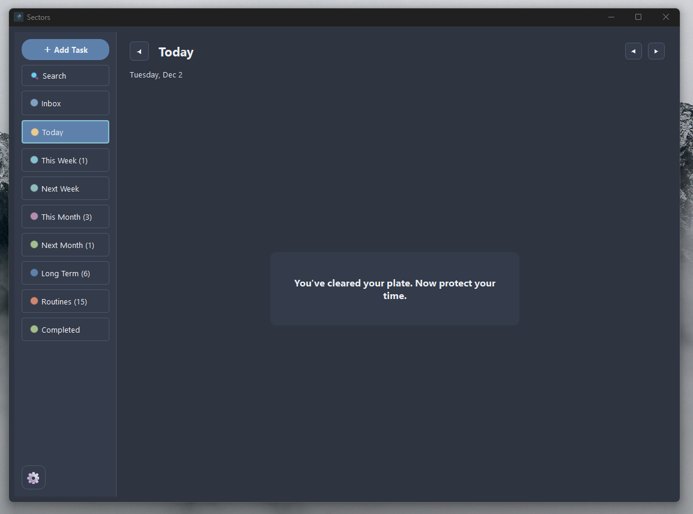

  

# Sectors

Sectors is a simple desktop task manager built for focus.
It uses time buckets instead of one long list. You drop tasks into clear zones so you see what matters now and what can wait.
It is inspired by **Carl Pullein’s Time Sector System**, adapted into a desktop workflow.

  

## How it works

Sectors gives you fixed buckets:

* Inbox
* Today
* This Week
* Next Week
* This Month
* Next Month
* Long Term
* Routines

Tasks sit in one bucket at a time. You move them forward as you plan your week.
This keeps the load clear and stops list overload.

## Features

* Time-based task buckets
* Tags, priorities, and due dates
* Notes for each task
* Fast search
* Routine tasks with auto-generation
* Local storage on your machine
* Clean layout with calm visuals
* Goals

## Downloads

Get the latest version on the **Releases** page:

**Windows:** [Sectors-0.5.0-Setup.exe](https://github.com/mmarco2121/sectors/releases/download/v0.5.0/Sectors-0.5.0-Setup.exe)

**Linux (.deb):** [Sectors_0.5.0-1_amd64.deb](https://github.com/mmarco2121/sectors/releases/download/v0.5.0/Sectors_0.5.0-1_amd64.deb)

## Install

**Windows:**
Download the EXE and run it.
If SmartScreen warns, choose *More info* then *Run anyway*.

**Linux:**
Download the .deb file
Install it using your software center or:
sudo dpkg -i Sectors_0.5.0-1_amd64.deb

## Status

Sectors is early-stage software.
Feedback helps shape the next version.

---

## Disclaimer

Sectors is an independent project.
It is **not** affiliated with or endorsed by Carl Pullein or the official Time Sector System.
References are made only to acknowledge conceptual inspiration.

