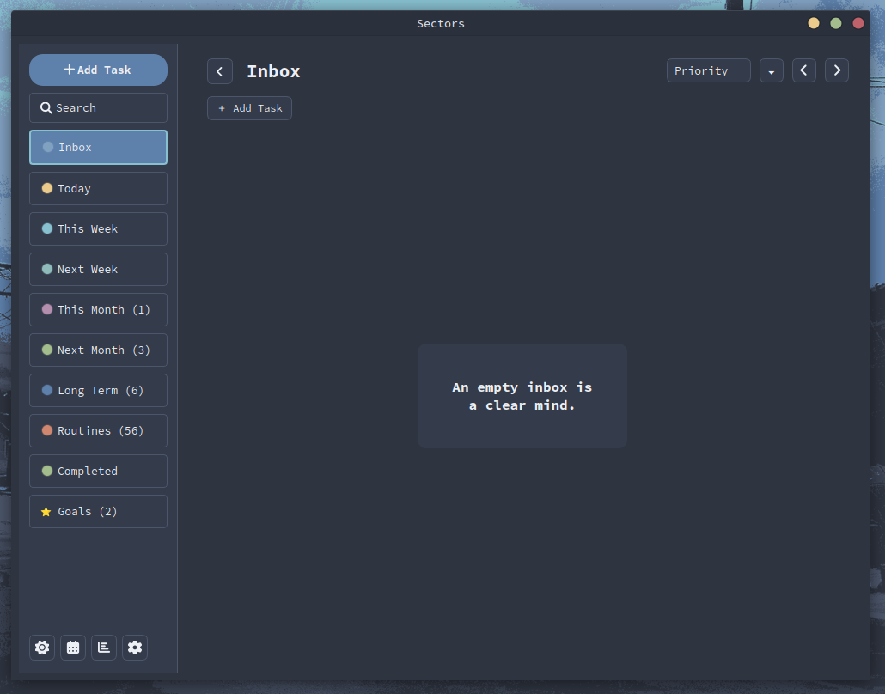

<p align="center">
  
</p>

# Sectors
A simple desktop task manager built for focus. Organize tasks into time-based sectors instead of one overwhelming list, so you can see what matters now and what can wait.
Inspired by Carl Pullein's Time Sector System, adapted for desktop workflows.

<p align="center">
  
</p>

## How It Works
Sectors organizes your tasks into clear time horizons:

- Inbox - Capture everything first
- Today - What you're doing today (2+8 priority system)
- This Week - Tasks for this week
- Next Week - Next week's work
- This Month - This month's projects
- Next Month - Planning ahead
- Long Term - Future goals
- Routines - Recurring tasks

Tasks live in one sector at a time. Move them forward as you plan your day and week.

## Features
✅ Time-based task organization
🏷️ Tags, priorities, and due dates
📝 Notes with Markdown support
🔍 Fast search across all tasks
🔄 Recurring routines with auto-generation
🎯 Goal tracking with task linking
💾 Local storage - your data stays on your machine
🎨 Multiple themes for comfortable viewing

## Downloads
Get the latest version from the Releases page:

Windows: Sectors-1.1.0.exe

Linux (.deb): Sectors_1.1.0-1_amd64.deb

Linux (Flatpak): Sectors-1.1.0.flatpak

## Installation
Windows: Download the EXE and run it. If Windows SmartScreen warns you, click "More info" then "Run anyway".

Linux (.deb): Download and install via your software center, or:
```bash
sudo dpkg -i Sectors_1.1.0-1_amd64.deb
```
Linux (Flatpak): Download and install:
```bash
flatpak install Sectors-1.1.0.flatpak
```
## The 2+8 System
In the Today sector, the app enforces focus:
- Maximum 2 Must Do tasks
- Up to 8 Should Do tasks
- Unlimited Could Do tasks

This constraint forces you to choose what truly matters each day.

## Quick Start
- Add tasks to your Inbox
- Process the Inbox - move tasks to appropriate sectors
- In Today, pick your 2 Must Do tasks for the day
- Work through your list and check off completed tasks
- At day's end, move unfinished tasks to the right sector

## Status
Sectors is early-stage software. Your feedback helps shape future versions.

## Disclaimer
Sectors is an independent project, not affiliated with or endorsed by Carl Pullein or the official Time Sector System. References acknowledge conceptual inspiration only.

